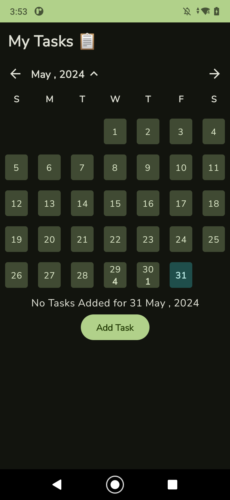

# My Tasks 📝

## 📸 Screenshots
|   |   |   |
|---|---|---|
|||

|   |   |   |
|---|---|---|
|||

|   |   |   |
|---|---|---|
|||

## 🎥 Video

## Built With 🛠
- [Kotlin](https://kotlinlang.org/) - First class and official programming language for Android development.
- [Coroutines](https://kotlinlang.org/docs/reference/coroutines-overview.html) - For All Asynchronous operations in the project
- [Flows](https://kotlinlang.org/docs/flow.html) 
- [ViewModel](https://developer.android.com/topic/libraries/architecture/viewmodel) - Stores UI-related data that isn't destroyed on UI changes. 
- [Compose Navigation](https://developer.android.com/develop/ui/compose/navigation) - For Navigation between Composables
- [Dependency Injection](https://developer.android.com/training/dependency-injection) 
  - [Dagger-Hilt](https://dagger.dev/hilt/) - Hilt provides a standard way to use DI in your application by providing containers for every Android class in your project and managing their lifecycles automatically
- [GSON](https://github.com/google/gson) - A modern JSON library for Kotlin and Java.
- [Retrofit](https://square.github.io/retrofit/) - A type-safe HTTP client for Android and Java.
- [GSON Converter](https://github.com/square/retrofit/tree/master/retrofit-converters/gson) - A Converter that uses Gson for serialization to and from JSON.
- [Material 3](https://github.com/material-components/material-components-android) - Google's open-source design system
- [Mockk](https://mockk.io/) - mocking library for Kotlin
- [kotlinx-coroutines-test](https://developer.android.com/kotlin/coroutines/test) - For Testing Coroutines on Android
